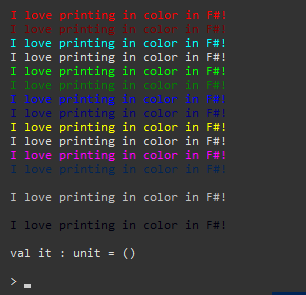

# fchalk
[](https://www.nuget.org/packages/fchalk) [](https://www.nuget.org/packages/fchalk) 

A simple utility library for colorizing console output in f#.

Inspired by [this blog post on the Microsoft Developer blog](https://blogs.msdn.microsoft.com/chrsmith/2008/10/01/f-zen-colored-printf/).

## Installation

```sh
# dotnet cli:
> dotnet add package fchalk

# paket cli:
> paket add fchalk

# NuGet package manager:
PM> Install-Package fchalk
```
```f#
// F# script file
#r "nuget: fchalk, 2.0.0"
```

## Example


## Output


